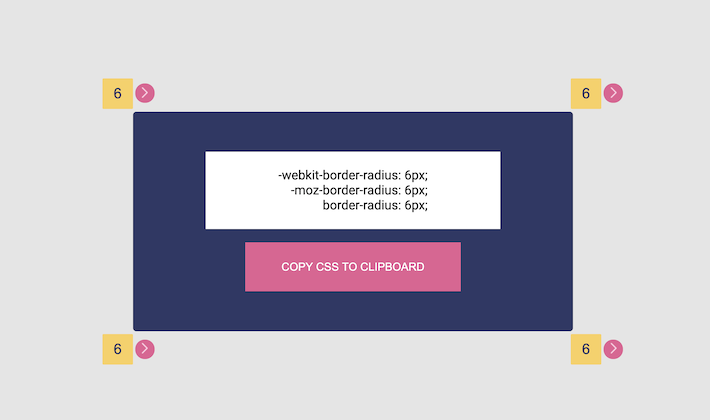

# Border Radius Generator

## General info

Simple generator where user can input border radius and get as a result CSS source code.

## Technologies

- JavaScript (ES8)

## More versions

You can find more versions of this project, which I created with popular framework (_in progress_):

- [React.js](link)

- [Angular](link)

- [Vue.js](link)

## Status

Project is: _in progress_

To Do:

- [ ] split into separate modules

- [ ] add tests

## Credits

Design inspired by UI Design Daily [project](https://uidesigndaily.com/posts/figma-blog-page-components-article-button-card-subscribe-day-1147)

## Contact

Created by [@aksrugiw](https://github.com/aksrugiw) - feel free to contact me!
